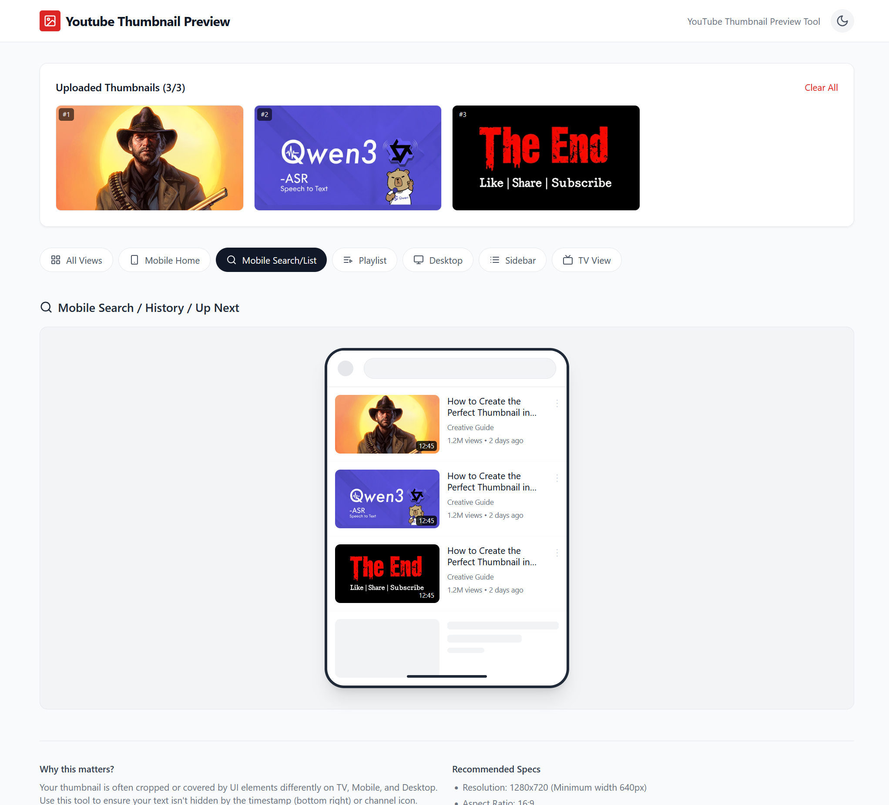
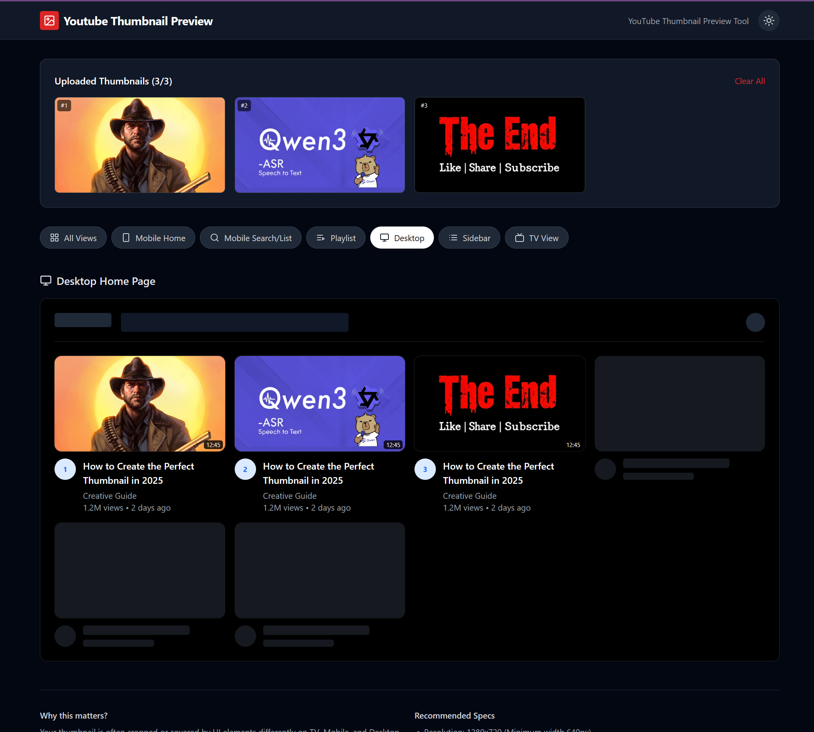

# Youtube Thumbnail Preview

A React-based tool to preview YouTube thumbnails in various contexts (Mobile, Desktop, TV) to ensure they look perfect before publishing.

## Demo

http://nkaushik.in/youtube-thumbnail-preview/

## Features

- **Multi-Context Preview**: See how your thumbnail looks on Mobile Home, Search, Playlists, Desktop, Sidebar, and TV.
- **Comparison**: Upload up to 3 thumbnails to compare them side-by-side.
- **Dark Mode**: Toggle between light and dark themes to check visibility.
- **Safe Zone Checks**: Visualize where timestamps and UI elements might cover your thumbnail.

## Previews

### Light Mode

### Dark Mode

## Tech Stack

- React
- Vite
- Tailwind CSS
- Lucide React
